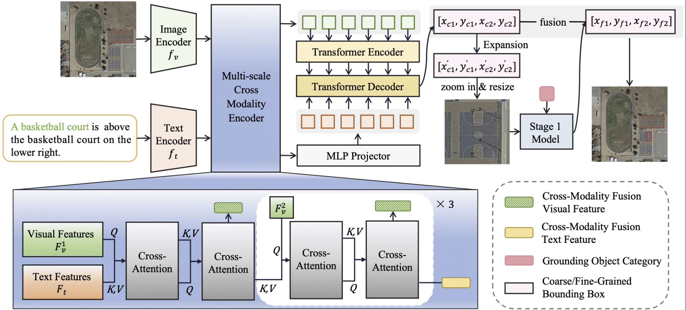

The official implementation of ZoomVG.

<div align="center">
<h1>
<b>
Accurate and Robust: Dynamic Image Zooming for Remote Sensing Visual Grounding
</b>
</h1>


</div>


<p align="center"></p>


### Abstract

Recent advancements in natural image visual grounding have shown promising results, however, existing approaches struggle to realize precise grounding in remote sensing (RS) images. This challenge arises from two key issues: first, the prevalence of small objects and dense spatial distributions in RS images makes accurate localization difficult; second, the large domain gap and lack of contextual priors in RS data hinder robust language-vision alignment. To address these issues, we propose ZoomVG, a novel framework for fine-grained visual grounding in high-resolution RS images. The core idea is to refine the initial coarse localization through a zoom-in mechanism and a furthur re-prediction stage. Specifically, the model first predicts a coarse bounding box using a multi-scale cross-modality encoder and Transformer decoder, which progressively align and fuse visual and textual features. The predicted region is then enlarged to capture additional contextual information. Combined with only category text, the cropped region is then re-encoded by the same model to obtain a refined grounding results. A late fusion strategy combines the coarse and refined predictions for final localization. To support this process, we construct a zoom-in training dataset by randomly expanding ground truth bounding boxes, simulating spatial uncertainty. ZoomVG achieves outstanding performance on several benchmarks.


## Installation

Please refer to [install.md](install.md) for installation.

## Data Preparation

First, download RSVG datasets and put them under data folder:
Download the DIOR-RSVG dataset from [Here](https://github.com/ZhanYang-nwpu/RSVG-pytorch?tab=readme-ov-file);
download the OPT-RSVG dataset from [Here](https://github.com/like413/OPT-RSVG);
download the RSVG-HR dataset from [Here](https://github.com/LANMNG/LQVG/tree/main/RSVG-HR).

To preprocess the dataset, simply run:

```bash
python preprocessdior.py
```

This script will:
- Parse the original annotation and image files.
- Generate split and cropped versions of the data.
- Save all processed annotations and images into the `data/DIOR_RSVG_addpatch` directory.
- Create a new `train.txt` file in the same directory, containing both the original and augmented sample indices.

Make sure your original dataset is placed in the `data/DIOR_RSVG` directory before running the script.

## Get Started

Please see the detail in tran.sh and inference.sh


## Acknowledgement

Our implementation is inspired by [LQVG](https://github.com/LANMNG/LQVG/tree/main).  
If you use this code or ideas, please also cite:

```bibtex
@article{lan2024language,
  title={Language query based transformer with multi-scale cross-modal alignment for visual grounding on remote sensing images},
  author={Lan, Meng and Rong, Fu and Jiao, Hongzan and Gao, Zhi and Zhang, Lefei},
  journal={IEEE Transactions on Geoscience and Remote Sensing},
  year={2024},
  publisher={IEEE}
}
```